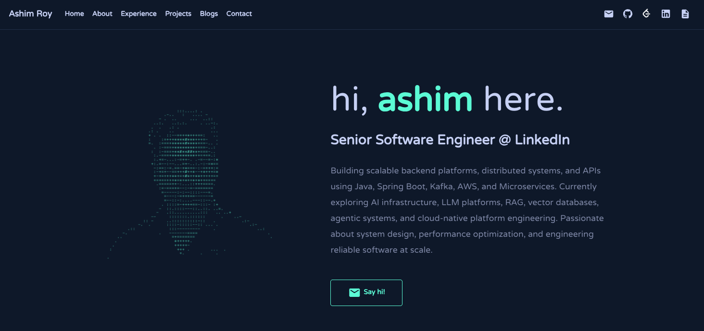

<h1 align="center">

  Swarup Kar Chaudhuri

</h1>

<p align="center">

  Backend Developer • Python • Java • FastAPI • React • AI/ML • RAG • LLM Applications

</p>

<p align="center">

  A modern interactive developer portfolio built with React, Vite, Material UI, and Bootstrap.

</p>

<p align="center">

  <a href="https://www.linkedin.com/in/swarup-kar-chaudhuri-4266a7260">LinkedIn</a> •
  <a href="https://github.com/swarup-infy">GitHub</a> •
  <a href="https://leetcode.com/u/swarup_infy/">LeetCode</a> •
  <a href="https://medium.com/@officially.swarup">Medium</a>

</p>

<p align="center">

  

</p>

<p align="center">

  🌐 <a href="YOUR_PORTFOLIO_URL">
    Live Portfolio
  </a>

</p>


## 🚀 Overview

This repository contains the source code for my personal developer portfolio.

The portfolio is designed to showcase my education, technical skills,
projects, experience, interests, and journey as a software developer.

I am a **B.Tech Electrical Engineering graduate from North Eastern Regional
Institute of Science and Technology**, with a strong interest in software
development, backend engineering, and artificial intelligence.

I enjoy building practical applications and learning through real-world
projects using **Python, Java, FastAPI, React, PostgreSQL, and modern AI
technologies**.


### Highlights

* B.Tech in Electrical Engineering — 2026

* North Eastern Regional Institute of Science and Technology

* Backend Development

* Python & Java

* FastAPI & REST APIs

* React & Modern Web Development

* PostgreSQL & SQLAlchemy

* Machine Learning

* Natural Language Processing

* Large Language Models

* Generative AI

* Retrieval-Augmented Generation (RAG)

* Vector Databases

* AI-powered Applications


## ✨ Portfolio Features

### 🎨 Interactive Developer Interface

A modern dark-themed developer portfolio with a clean interface,
responsive layouts, smooth animations, and consistent visual styling.

### 🧑‍💻 ASCII Portrait

The portfolio includes a custom ASCII-based developer portrait created
from an image and rendered using characters on a canvas.

The rendering focuses on:

* Character-based image representation
* Brightness-based rendering
* Facial details
* Hair and clothing outlines
* Dynamic canvas rendering
* Theme-aware styling

### 🎮 Interactive Game Mode

The portfolio also contains an optional browser-based game mode.

Visitors can enable the game and interact with the portfolio using keyboard
controls.

**Controls:**

| Key | Action |
|-----|--------|
| `←` | Move left |
| `→` | Move right |
| `Space` | Jump |
| `Scroll` | Explore |

The game includes collectible points, platforms, character animation,
progress tracking, win conditions, and game-over conditions.


## 🛠️ Tech Stack

### Languages

```text
Python
Java
JavaScript
HTML
CSS
